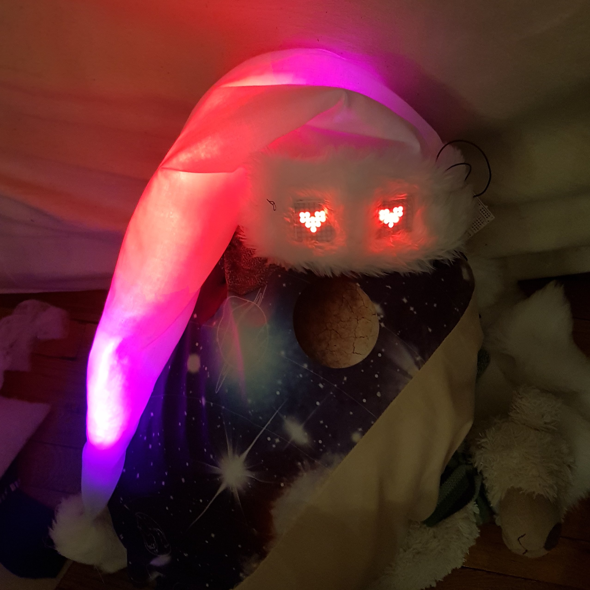
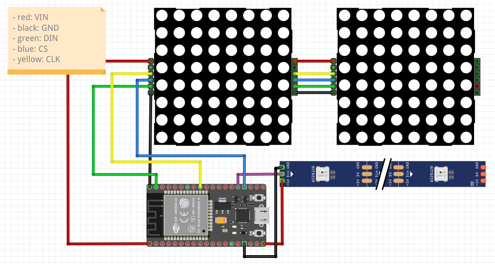

# Protobonnet

What is it? A connected Santa Claus hat! 

What is it called? Le ProtoBonnet!

Why? This hat has been created entirely for the [Noël des protopotes](https://www.protopotes.stream/noel/) a special livestream event happening on the 27th of December, 2021.

## Protopotes

[Les protopotes](https://raid.protopotes.stream/) are a French-speaking collective bringing together content creators (DIY, electronics, sewing, computer development, etc.) on the Internet (mainly on Twitch).

## Context

For their first collaboration, Les protopotes decided to organised a christmas twitch stream. The live is hosted by [Neodyme](https://www.twitch.tv/ioodyme) and [Kathleen](https://www.twitch.tv/KathleenFabric) (aka Daddy and Mommy Christmas) from Switzerland. The goal was to create 6 connected costume parts that could interact with the live and people in the chat. 

I was part of the team making Kathleen's hat, along with [Tix le Geek](https://tixlegeek.io/) and [Hippo](http://les-ateliers-de-hippo.fr/).

We had the idea to create a hat with two eyes and white fabric in orter to change its color while reacting to events, and also launch two quizzes directly on twitch. 

I was personnally charged to sew the hat, make the electronics and program it (well basically this repository) in order for it to react to MQTT messages.

Viewers can trigger actions and commands through a dedicated web interface in exchange of protopoints (currency created for the event that can be obtained in exchange of Twitch channel points).

## Installation 

#### Hardware 

* ESP32
* RGB LEDs strip WS2812b 60/m
* 2 red LEDs MAX7219 matrices (I used [Led-Matric-editor](https://xantorohara.github.io/led-matrix-editor) to create the animations)

#### Firmware

This project uses PlatformIO. You will need VSCode with the PlatformIO extension installed. The following libraries are required:
* [FastLED](https://github.com/FastLED/FastLED)
* [LedControl](https://github.com/wayoda/LedControl)
* [PubSubClient](https://github.com/knolleary/pubsubclient)
* [ArduinoJson](https://github.com/bblanchon/ArduinoJson)

Don't forget to update your SSID and MQTT info in `secret.h`!

#### Santa Hat

To create the hat, I sewed it myself following a youtube tutorial by [Tock Custom](https://www.youtube.com/watch?v=YAwPCVWVTEs), I just changed the fabric in order to diffuse the light. 

## Wiring

